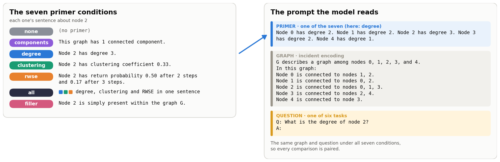
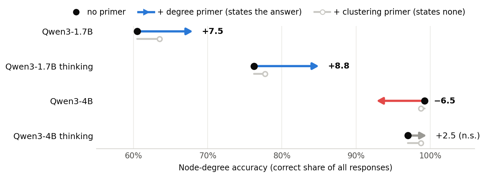
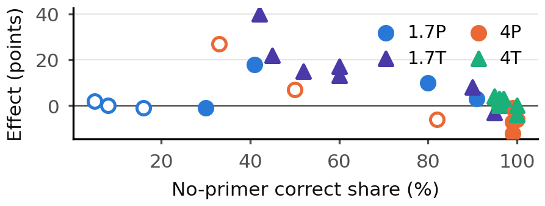

<h1 align="center">Talk Like a Structured Graph</h1>

<p align="center">
  <em>Does telling an LLM each node's degree, clustering or random-walk statistics<br>
  help it answer questions about a graph written as text?</em>
</p>

<p align="center">
  <a href="paper/paper.pdf"></a>
  <a href="https://arxiv.org/abs/2310.04560"></a>
  
  
</p>

A course project for *Machine Learning with Graphs* (Tel Aviv University) that
extends [Talk like a Graph](https://arxiv.org/abs/2310.04560) (Fatemi et al.).
We prepend a **primer** (short factual sentences about each node's local structure)
to GraphQA's text encoding of a graph, and compare the same graphs with and without
it in paired tests.

## The experiment

<p align="center"></p>

Each prompt is a primer, then GraphQA's incident encoding of the graph, then the
question. The seven conditions go through one renderer (`graphtalk/primers.py`), so
they differ in content only, and every model sees the same graphs under all seven.

We use 40-node Erdős–Rényi graphs at seven edge densities (p = .10 to .85),
6 GraphQA tasks, 7 primer conditions, and Qwen3-1.7B and Qwen3-4B with and without
thinking: 84,000 paired responses. A graph-blind solver that reads only the primer
text shows which primers give the answer away. It parses the rendered primer text
and never sees the graph, so its score is what the primer alone gives away: a model
at or below it need not have read the graph at all.

## Key findings

<p align="center">
  <b>A structural hint helps only when it hands over an answer the model can't compute itself,<br>
  and it hurts a model that already can. Hints that don't state the answer barely move accuracy.</b>
</p>

<p align="center">
  
  <br>
  <sub>Node degree on 40-node graphs, 400 paired graphs per model. Blue and red changes are significant
  (Benjamini–Hochberg q &lt; .05); gray ones are not.
  Details: <a href="docs/results/n40-sweep.md#3-every-primer-against-no-primer">n40-sweep §3</a>.</sub>
</p>

- **Stating the answer helps a model that computes it unreliably, and hurts one
  that computes it reliably.** On node degree, the `degree` primer adds +7.5 points
  for Qwen3-1.7B and +8.8 with thinking, but costs Qwen3-4B −6.5 (99.25% → 92.75%).
  [n40-sweep §3](docs/results/n40-sweep.md#3-every-primer-against-no-primer)
- **Statistics that don't state the answer have smaller effects**, and their sign
  depends on the statistic and the model. Where structure-free `filler` text lowers
  accuracy, clustering and RWSE mostly do not.
  [n40-sweep §7](docs/results/n40-sweep.md#7-side-information-is-small-and-non-specific)
- **Correct is not the same as right.** On cycle detection, only about a third of
  the correct answers given without thinking or a primer rest on a real cycle,
  against 80.9–96.4% with thinking.
  [cycles §5](docs/investigate_connections_and_cycles.md#5-cycle_check-do-correct-answers-rest-on-real-cycles)

<p align="center">
  
  <br>
  <sub>The <code>degree</code> primer's effect on node degree against the correct share without a primer,
  one point per model and edge density (P/T: thinking off/on). The gain is largest where a model is
  right about half the time and becomes a loss where it is right most of the time. Hollow: plain model
  at p ≥ .65 (smaller token budget). Paper Figure 3; details:
  <a href="docs/results/n40-sweep.md#4-a-primer-that-states-the-answer-changes-the-procedure">n40-sweep §4</a>.</sub>
</p>

<details>
<summary><b>Every primer against no primer</b> (paper Table 1)</summary>

| Task | Model | none | degree | clustering | RWSE | all | components | filler |
|---|---|--:|--:|--:|--:|--:|--:|--:|
| Degree ★ | 1.7P | 60.50 | **+7.5**<sup>f</sup> | +3.0 | +4.0 | **+10.2**<sup>f</sup> | +1.8 | −0.5 |
| | 1.7T | 76.25 | **+8.8**<sup>f</sup> | +1.5<sup>f</sup> | +2.5<sup>f</sup> | **+12.2**<sup>f</sup> | −1.0 | −3.0 |
| | 4P | 99.25 | **−6.5**<sup>f</sup> | −0.5 | **−2.2** | **−8.0**<sup>f</sup> | +0.2 | −0.5 |
| | 4T | 97.00 | +2.5 | +1.8 | −1.2<sup>f</sup> | +0.5 | +0.2 | +2.0 |
| Neighbors | 1.7P | 72.50 | +3.5<sup>f</sup> | +1.2<sup>f</sup> | +1.0<sup>f</sup> | +2.0<sup>f</sup> | +0.8<sup>f</sup> | **−6.2** |
| | 1.7T | 78.75 | **+6.2** | +2.0 | +0.2 | **+6.2** | +2.5 | +2.5 |
| | 4P | 86.00 | −3.0<sup>f</sup> | +1.0<sup>f</sup> | +0.0<sup>f</sup> | −2.8<sup>f</sup> | **+9.2**<sup>f</sup> | **−12.5** |
| | 4T | 95.50 | +0.5 | −0.8 | +0.5 | −1.2 | +0.5 | +1.2 |
| Edge count ★ | 1.7P | 1.25 | +3.0† | −0.5† | −0.8† | +0.8† | −1.0† | −0.5† |
| | 1.7T | 15.75 | −3.2† | −1.2† | −3.2† | +5.0† | −0.8† | −1.5† |
| | 4P | 2.00 | **+27.2**<sup>f</sup> | −1.2<sup>f</sup> | −1.5<sup>f</sup> | **+3.8** | −1.2<sup>f</sup> | +1.2 |
| | 4T | 20.00 | +8.5† | +24.8† | +10.2† | +1.8† | +24.8† | +12.2† |
| Edge exists | 1.7P | 70.50 | +4.0<sup>f</sup> | +3.8<sup>f</sup> | +5.0<sup>f</sup> | **+11.5**<sup>f</sup> | **−8.2**<sup>f</sup> | **−15.8** |
| | 1.7T | 99.00 | −2.5 | −1.0 | −1.2 | −1.8 | −0.8 | −0.5 |
| | 4P | 90.50 | **−4.8** | **+4.0**<sup>f</sup> | **−10.0** | **−10.0** | −2.8<sup>f</sup> | **−7.0** |
| | 4T | 99.75 | +0.0 | −0.8 | −1.2 | −1.0 | −0.5 | +0.0 |

Correct share without a primer (% of all prompts) and the paired change under each
primer (points), on the same 400 graphs per row (p ≤ .50). ★: on this task, `degree`
and `all` state the answer. Bold: q < .05 against no primer (Benjamini–Hochberg within
model, task and control); <sup>f</sup>: q < .05 against `filler`; †: at least 15%
truncation on either side. P/T: thinking off/on. Intervals:
[n40-sweep §3](docs/results/n40-sweep.md#3-every-primer-against-no-primer).

</details>

## Repository map

| Folder | What's inside | Start here |
|---|---|---|
| [`paper/`](paper/) | The paper, its LaTeX source, and the scripts behind every table and figure | [paper/README.md](paper/README.md) |
| [`docs/`](docs/) | The results, one doc per family of runs, plus the analyses behind the paper's discussion | [docs/README.md](docs/README.md) |
| [`scripts/`](scripts/) | The pipeline, from prompt building to every analysis | [scripts/README.md](scripts/README.md) |
| [`data/`](data/) | The committed inputs: prompts, the models' raw responses, the solver bars | [data/README.md](data/README.md) |
| [`outputs/`](outputs/) | What the scripts print and write; the docs and paper cite these | [scripts/README.md](scripts/README.md#outputs) |
| [`graphtalk/`](graphtalk/) | The package: primers, the graph-blind solver, prompts, scoring | module docstrings |
| [`cluster/`](cluster/) | How responses were generated on the TAU GPU cluster | [cluster/README.md](cluster/README.md) |
| [`preliminary/`](preliminary/) | The pilot and screens that chose the 40-node settings | [preliminary/README.md](preliminary/README.md) |
| [`talk_like_a_graph/`](talk_like_a_graph/) | Google Research's reference code, vendored | [UPSTREAM.md](talk_like_a_graph/UPSTREAM.md) |

## Quickstart

Only generation needs a GPU; everything else reruns on a laptop from the committed
responses. Needs Python 3.11 or later.

```bash
uv venv --python 3.11 && uv pip install -e ".[dev]"
uv run --no-sync pytest -q                     # ~830 tests, ~15 min on a laptop
```

Without `uv`: `python -m venv .venv`, activate it, `pip install -e ".[dev]"`, and
drop `uv run --no-sync` from the commands below. With `uv`, keep `--no-sync`: a
plain `uv run` re-syncs the environment and removes extras such as `[gpu]`.

The solver's score rests on two groups of tests in `tests/test_shortcuts.py`. The
**round trip** renders every primer, parses it back from its text and requires the
rounded values exactly; the parser shares no code with the renderer, so this catches
a format change nobody meant to make. **Theorem precision** requires each exact rule
to be right every time, on Erdős–Rényi graphs and on trees, forests, cycles and
complete bipartite graphs, which the ER generator never produces.

Reproduce the main experiment's numbers from the committed responses (no GPU):

```bash
export PYTHONPATH=. PYTHONUTF8=1
uv run --no-sync python scripts/build_raw_frame.py
uv run --no-sync python scripts/primer_findings.py --csv-dir outputs/n40-sweep > outputs/n40-sweep/primer_findings.txt
uv run --no-sync pytest -q tests/test_results_docs.py
```

<details>
<summary><b>Reproduce every number</b> (about an hour on a laptop)</summary>

The full list, in order, is in [scripts/README.md](scripts/README.md#reproduce-everything).
It rebuilds the frame, reruns each analysis into `outputs/`, reruns the density
follow-ups, and then the paper's table and figure scripts.

</details>

<details>
<summary><b>Generate responses on a GPU</b></summary>

`scripts/run_sweep.py` is the only stage that needs a GPU (`pip install -e ".[gpu]"`).
[cluster/README.md](cluster/README.md) covers how every response in `data/runs/`
was generated on the TAU CS cluster, and
[cluster/run-4b-density-sweep.md](cluster/run-4b-density-sweep.md) is the exact
recipe for one arm.

</details>

<details>
<summary><b>Build the paper</b></summary>

```bash
cd paper
pdflatex paper && bibtex paper && pdflatex paper && pdflatex paper
```

[paper/README.md](paper/README.md) also regenerates each table and figure, and
says where every number in the paper comes from.

</details>

## Earlier work

The 40-node design came out of earlier screens:
- a pilot on GraphQA's published 5–19-node graphs, where most models were
  near ceiling without a primer;
- Game-of-Thrones node names;
- a size sweep;
- a difficulty ladder and a retrieval probe.

These live in [`preliminary/`](preliminary/README.md) with their own scripts,
data and tests, all still runnable. Replaced drafts of the paper and the
analyses are kept in git tag `pre-cleanup` (`git checkout pre-cleanup`).

## Credits

Gal Barak ([@GalBrk](https://github.com/GalBrk)), Nitzan Zacharia
([@NitzanZacharia](https://github.com/NitzanZacharia)) and Inbal Moryles
([@iinbal](https://github.com/iinbal)). The graph generators and
text encoders in `talk_like_a_graph/` are Google Research's (Apache-2.0); see
[UPSTREAM.md](talk_like_a_graph/UPSTREAM.md) for the commit and the local changes.
