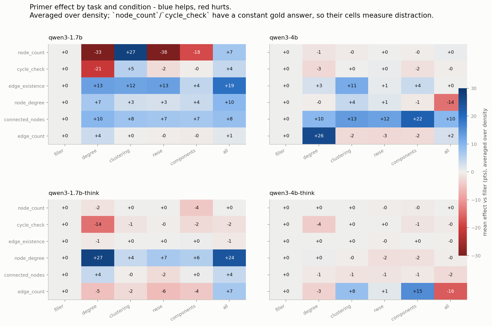
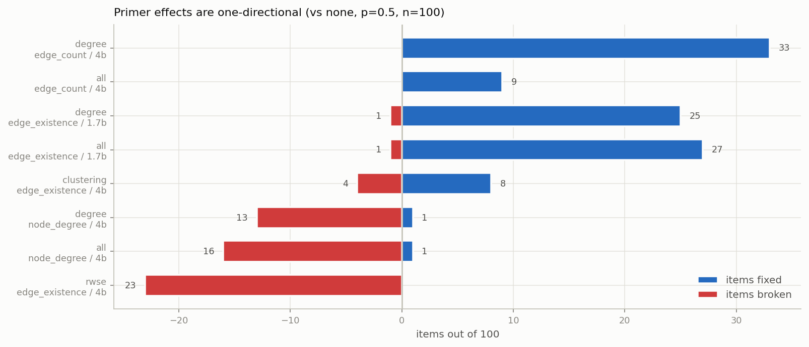
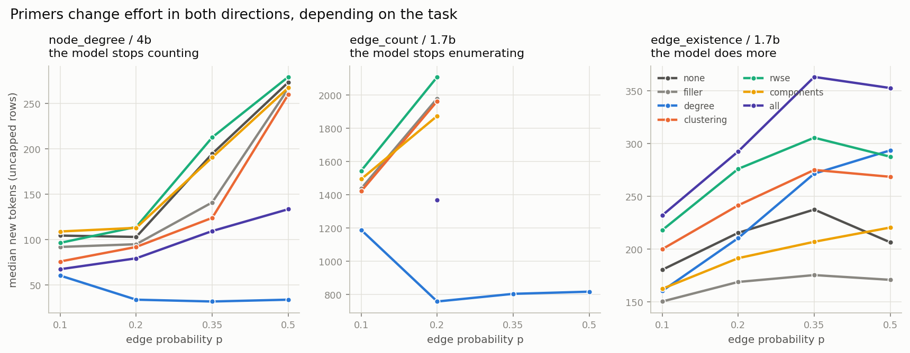
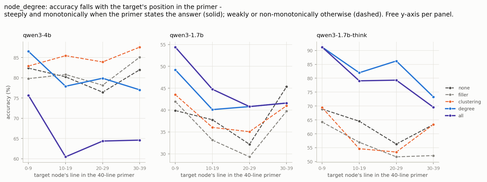
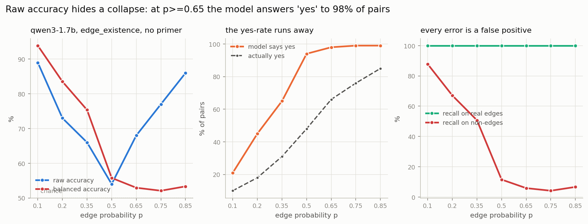
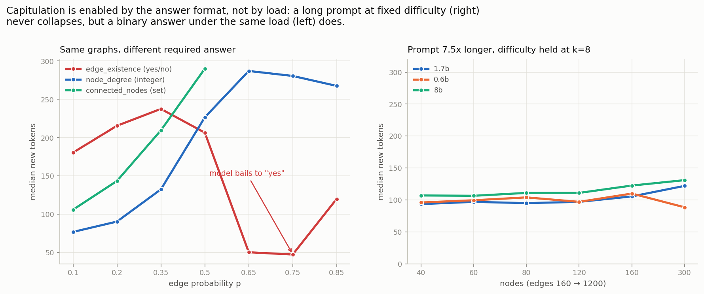
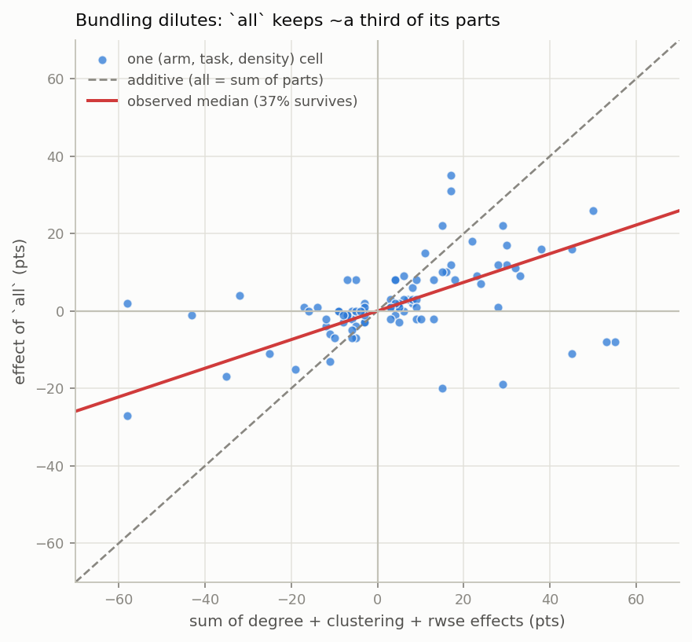
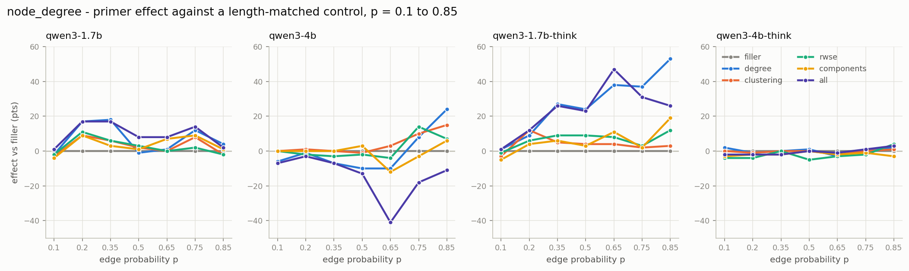
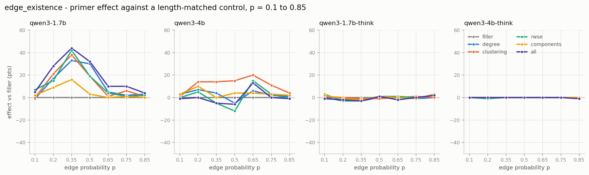

# Raw-data trends in the 40-node density sweep

An independent rebuild of the `densfull40` / `densfull40hi` sweep straight from
`runs/*.jsonl`, written without consulting any existing analysis CSV or doc until
the reconciliation section at the end. Four arms (`qwen3-1.7b`, `qwen3-4b`, and
both `-think` variants), six GraphQA tasks, seven primer conditions, seven pinned
densities, **84,000 responses over 700 graphs**.

Scripts: `scripts/build_raw_frame.py` (raw -> `csv2/raw-trends/frame.csv`),
`scripts/raw_trends.py` (Q1-Q7 -> one CSV each), `scripts/raw_trends_figures.py`
(-> `analysis/raw-trends/*.png`).

```bash
PYTHONPATH=. python scripts/build_raw_frame.py
PYTHONPATH=. python scripts/raw_trends.py --question all
PYTHONPATH=. python scripts/raw_trends_figures.py
```

---

## What the data actually is

| | |
|---|---|
| `densfull40` | 6 tasks x 7 conditions x 4 densities (0.1/0.2/0.35/0.5) x 100 graphs |
| `densfull40hi` | 2 tasks (`node_degree`, `edge_existence`) x 7 x 3 densities (0.65/0.75/0.85) x 100 |
| arms | `qwen3-1.7b`, `qwen3-1.7b-think`, `qwen3-4b`, `qwen3-4b-think`, all `zero_shot` |
| total | 84,000 rows after dropping 2 duplicate keys; **all 840 cells are exactly n=100** |

**The corpus is exactly reproducible.** `scripts/build_size_sweep.py` derives the
ER seed as `20260906 + 1e6*(1+round(p*1000)) + 1000*size + index` — with **no task
term**. Every graph, queried node and gold answer is recoverable from
`instance_id`. The frame builder regenerates all 84,000 and aborts on any gold
mismatch; **0 mismatches**.

Because the seed has no task term, **one graph serves all six tasks** at a given
`(density, index)`, and `make_row` re-seeds from that same seed per task. Verified
over all 700 graphs: `node_degree` and `connected_nodes` query the **same node**
(700/700), and `edge_existence`'s source node is that same node (700/700).

This does not damage the paired design — comparing conditions within a task pairs
an identical graph and an identical question. It has two consequences that are
handled explicitly:

- **Variance.** Intra-graph ICC of correctness is 0.12 (1.7b) / 0.06 (4b). Because
  the graph effect cancels in paired differences the practical impact is small: a
  bootstrap of `all` vs `none` pooled over six tasks gives CI width 7.0 naive vs
  6.7 graph-clustered. `graph_id` is carried in the frame as a guard.
- **A free instrument.** Graph *and* queried node held fixed while the required
  output changes is a controlled measurement of the output operation (Q3b).

The six tasks stay six distinct tasks, as in arXiv:2310.04560. Counting a
neighbour set and reproducing it are different operations and the data agrees:
phi between their correctness is 0.49 / 0.06 / 0.55 / 0.26 by arm — related, not
duplicate.

### Scoring decisions that change the conclusions

1. **Exact match everywhere, including `connected_nodes`.** Set-F1 hides almost
   all the movement there: `qwen3-4b` / `filler` / p=0.1 is **94.3% F1 but 72%
   exact**; `qwen3-1.7b` at p=0.5 is ~95% F1 but **38-51% exact**.
2. **`node_count` and `cycle_check` have a constant gold at n=40** (always `40`,
   always `Yes`). Trials are independent so a deficit from 100% is real signal,
   but it measures **distraction**, not graph reasoning. Labelled as such
   throughout.
3. **`edge_existence` needs balanced accuracy.** Its gold yes-rate tracks density
   (10% -> 18% -> 31% -> 48% -> 66% -> 76% -> 85%), so raw accuracy conflates skill
   with a moving majority baseline. See Q4/M3 — this is not a technicality, it
   inverts the high-density reading.
4. **Both baselines on every effect**: `vs none` (net) and `vs filler` (content,
   length-matched). `filler` is itself a large effect in several cells.
5. **`hit_cap` handled twice** (scored wrong, and dropped) and reported as its own
   outcome. Length statistics use non-capped rows only — a capped response is
   truncated, not long — and are suppressed entirely where the cap rate exceeds
   20%.

---

## Q3 — What makes a task hard?



### Between tasks: aggregation load, not graph size

Exact match under `none`:

| task | gold kind | 1.7b (p=.1/.2/.35/.5) | 4b | 4b-think |
|---|---|---|---|---|
| `cycle_check` | constant | 83 / 92 / 94 / 100 | 99 / 100 / 100 / 100 | 98 / 100 / 99 / 100 |
| `node_count` | constant | **2 / 0 / 28 / 96** | 92 / **69** / 100 / 100 | 98 / 100 / 100 / 100 |
| `edge_existence` | boolean | 89 / 73 / 66 / 54 | 96 / 93 / 83 / 90 | 100 / 100 / 100 / 100 |
| `node_degree` | integer | 91 / 80 / 41 / 30 | 100 / 99 / 99 / 99 | 97 / 95 / 97 / 100 |
| `connected_nodes` | set | 92 / 91 / 59 / 48 | 93 / 88 / 84 / 79 | 97 / 95 / 99 / 97 |
| `edge_count` | integer | 3 / 2 / 0 / 0 | 5 / 2 / 1 / 0 | 65 / 45 / 25 / 4 |

The ordering is driven by **how much of the edge list must be aggregated**:
`edge_count` requires summing ~400 edges and is at the floor for every
non-thinking arm at every density; the local-lookup tasks are near ceiling for the
strong models. Density matters mostly through the edge count it implies, not as an
independent difficulty axis.

**An anomaly worth its own line: `qwen3-1.7b` scores 2% / 0% / 28% / 96% on
`node_count`,** a task whose answer is always 40 and is stated in the prompt's own
node range. It *improves* with density. At low density the graph has isolated and
low-degree nodes, and the model appears to count the nodes it sees mentioned
rather than reading the stated range. This is a prompt-encoding failure, not a
reasoning one, and it is the single largest task deficit in the sweep.

### Output operation, with graph and queried node held fixed

`node_degree`, `connected_nodes` and `edge_existence` ask about the *identical
node of the identical graph*, so the gap between them isolates the cost of the
required output. **The sign flips by model:**

| arm | p=0.2 | p=0.35 | p=0.5 |
|---|---|---|---|
| `qwen3-1.7b` count − list | −11 | −18 | −18 |
| `qwen3-4b` count − list | **+11** | **+15** | **+20** |
| `qwen3-1.7b-think` | −1 | −8 | +1 |

The weak model can copy a neighbour list but miscounts it; the strong model counts
perfectly (99%) but loses exact-match points reproducing the set. **There is no
universal "counting is harder than listing"** — which operation binds depends on
the model. (An earlier draft of this analysis asserted the general version; the
full table refutes it.)

### Calibration: the shape of an `edge_count` error

`qwen3-4b`, errors only:

| p | cond | n wrong | median signed err | % undercount |
|---|---|---|---|---|
| 0.5 | `none` | 100 | **−64** | **95%** |
| 0.5 | `degree` | 67 | **+3** | 40% |
| 0.35 | `none` | 99 | −26 | 85% |
| 0.35 | `degree` | 75 | −1 | 52% |

Under `none` the model **systematically undercounts** — consistent with abandoning
a long enumeration part-way. Under `degree` the bias disappears and the residual
error is symmetric. Note the honest limit: the *magnitude* does not shrink (median
|err| 65 -> 115 at p=0.5). The primer converts a biased undercount into an
unbiased arithmetic slip; it does not make the surviving errors smaller.

---

## Q1 / Q2 — Which primer helps, which hurts, where

See the heatmap above (blue helps, red hurts, vs the length-matched `filler`
control, averaged over density).

### Biggest helps

| effect | cell | vs filler |
|---|---|---|
| `degree` on `edge_count` | `qwen3-4b` | **+26** (0-5% -> 25-33%) |
| `degree` on `node_degree` | `qwen3-1.7b-think` | **+27** (up to **+53** at p=0.85) |
| `components` on `connected_nodes` | `qwen3-4b` | **+22** |
| `all` on `edge_existence` | `qwen3-1.7b` | **+19** |
| `clustering` on `edge_existence` | `qwen3-4b` | **+11** |

### Biggest hurts

| effect | cell | vs filler |
|---|---|---|
| `rwse` on `node_count` | `qwen3-1.7b` | **−38** (constant-gold task) |
| `degree` on `node_count` | `qwen3-1.7b` | **−33** |
| `degree` on `cycle_check` | `qwen3-1.7b` | **−21** (answer is always "Yes") |
| `all` on `edge_count` | `qwen3-4b-think` | **−16** |
| `all` on `node_degree` | `qwen3-4b` | **−14**, and **−41** at p=0.65 |

The two constant-gold tasks carry the largest *negative* effects in the sweep. A
primer can push a model off an answer it would otherwise get for free — that is
distraction, cleanly measured.

### Effects are one-directional



A net effect hides its shape. Decomposed against `none` at p=0.5 (n=100):

| cell | net | fixed | broke |
|---|---|---|---|
| 4b `edge_count` `degree` | +33 | 33 | **0** |
| 4b `node_degree` `degree` | −12 | 1 | 13 |
| 4b `edge_existence` `rwse` | −23 | **0** | 23 |
| 4b `edge_existence` `clustering` | +4 | 8 | 4 |

`rwse` never once fixed an item it broke. `degree` never broke one on
`edge_count`. **`clustering` is the only condition with real two-way churn**, so
its small net is a different kind of effect from the others and should not be read
as a weak version of the same thing.

---

## Q5 — What the primer changes in the model's behaviour



### Length moves in both directions

Median new tokens, non-capped rows:

| cell | `none` | primer | |
|---|---|---|---|
| `node_degree`, 4b, p=0.5 | 273 | `degree` **34** | 8x collapse — stops counting, reads it off |
| `edge_count`, 1.7b, p=0.5 | 4036 | `degree` **1185** | + `hit_cap` 29.8% -> 9.5% |
| `edge_existence`, 1.7b, p=0.5 | 206 | `all` **352** | does *more* work, `Node N` mentions 2 -> 4 |
| `connected_nodes`, 4b, p=0.5 | 233 | `filler` **94** | content-free preamble: faster *and* worse |

"Primers add length" would be the wrong summary. The direction is task-specific.

### Strategy switches are real and measurable

- **`edge_count`, 1.7b, p=0.5: "sum the degrees, divide by 2" goes 7% (`none`) ->
  100% (`degree`)**, while `Node N` enumeration drops from 40 mentions to 0. A
  wholesale algorithm switch.
- **`edge_count`, 4b, p=0.1: `rwse` *suppresses* the correct sum/2 method**,
  100% -> 36%.
- `degree` raises `cycle_check` non-termination from 9.0% -> 17.2% (1.7b) and
  3.0% -> 24.2% (1.7b-think), on a task whose answer is always "Yes".

### But the switch does not explain the gain

Comparing, within a condition, responses that adopted sum/2 against those that did
not: **median gap +0.0 pts across 23 cells.** On `qwen3-1.7b` `edge_count` both
groups score ~0.

Limitation stated plainly: under `degree` the switch is 100%, so no
within-condition contrast exists in exactly the cell where the primer helps most.
The test is only available where the switch is partial, and there it is null. The
reading that survives: **the gain comes from the primer supplying the degree
values, not from the model adopting the strategy label.**

---

## Q4 — What primers actually do

### M1 — They substitute an arithmetic path for a traversal path

Directly observed, not inferred (Q5 above): `degree` flips `edge_count` from
enumeration to summation in 7% -> 100% of responses, cuts length 4036 -> 1185
tokens, and cuts non-termination 29.8% -> 9.5%. The calibration table (Q3)
confirms the error changes *character*: a −64-median systematic undercount becomes
a +3-median symmetric slip.

### M2 — Retrieval from the primer is lossy, and position in the primer matters



On `node_degree` under `degree` the answer is printed verbatim, yet `qwen3-4b`
errors rise 1% -> 13% at p=0.5, and when it errs the value returned is usually
another node's degree (median |err| 1.4-2.5 — off-by-a-line, not a reasoning
failure). Behaviourally, the same cell is where reasoning length collapses
273 -> 34 tokens: **the model traded a reliable 273-token count for an unreliable
34-token lookup.**

The primer lists nodes in id order, so the target's id *is* its line number.
Slope of correctness on line number, as points lost from the first line to the
40th, with a bootstrap 95% CI over ~700 items per cell (`slope_pts` in
`serial_position.csv`; bolded where the interval excludes zero). **All seven
conditions are shown** — an earlier version of this table omitted `rwse`, which
turns out to matter:

| arm | `none` | `filler` | `components` | `clustering` | `rwse` | `degree` | `all` |
|---|---|---|---|---|---|---|---|
| 1.7b | +3.7 | −4.7 | −4.1 | −4.5 | **−19.3** | −10.1 | **−18.4** |
| 4b | −1.3 | +5.3 | −1.5 | +4.4 | 0.0 | **−12.1** | −10.6 |
| 1.7b-think | −8.7 | **−16.4** | −1.7 | −9.1 | −7.2 | **−18.7** | **−24.3** |
| 4b-think | −2.1 | +0.4 | −1.8 | −0.9 | **−4.2** | **−2.8** | −1.5 |

**Node identity is ruled out.** Position and node id are the same variable, so
the finding collapses if late-numbered nodes are harder nodes. They are not: over
19,600 `node_degree` items, `corr(target_id, target_degree) = +0.019` and
`corr(target_id, target_clustering) = +0.020`. ER ids are assigned before edges
are drawn.

**Retrieval is not ruled in.** The ordering by primer kind is in the expected
direction — mean slope −12.3 for conditions that state the answer, −5.1 for
per-node primers that do not, −2.8 for the controls — and no `none` cell has an
interval excluding zero. But two cells break the clean story:

- `rwse` on 1.7b has the **steepest slope in the whole table** (−19.3) and never
  prints the queried degree.
- `filler` on 1.7b-think loses 16.4 points and contains *no per-node content at
  all*. A preamble that says nothing about any node still costs accuracy on nodes
  described late in it.

So position costs most where there is a value to find, but the cost is not only
the cost of finding it. Separating "retrieval fails further down a list" from
"any long preamble degrades with position" needs a shuffled-order primer, which
was not run. Two further limits: four quartiles cannot distinguish monotone decay
from a lost-in-the-middle shape, and the slope does not grow monotonically with
density (−9, −12, −24, −24, −12, −33, −18 across the seven levels for `degree` on
1.7b-think), so it should not be described as scaling with search length.

### M3 — They shift response bias, and raw accuracy can hide a total collapse



**This is the most consequential correction in this document.** On `qwen3-1.7b`
`edge_existence`, raw accuracy appears to *recover* at high density:

| p | gold yes | raw acc | **balanced acc** | recall on non-edges | model says yes |
|---|---|---|---|---|---|
| 0.35 | 31% | 66 | 75 | 51% | 65% |
| 0.5 | 48% | 54 | 56 | 12% | 94% |
| 0.65 | 66% | 68 | **53** | **6%** | **98%** |
| 0.75 | 76% | 77 | **52** | **4%** | **99%** |
| 0.85 | 85% | 86 | **53** | **7%** | **99%** |

At p >= 0.65 the model answers **"yes" to 98-99% of all pairs**. It has stopped
discriminating; balanced accuracy is at chance. Raw accuracy rewards it only
because 66-85% of pairs genuinely are edges. **Any table reporting raw accuracy
here shows a recovery that is in fact a total collapse.**

The same mechanism at readable densities: on `qwen3-4b`, recall on real edges is
~100% in nearly every cell — every error is a false positive — and primers inflate
the predicted-yes rate (gold 48% at p=0.5): `none` 58%, `filler` 69%, `degree`
74%, `all` 75%, `rwse` **81%**, while `clustering` alone pulls it *down* to 54%.
That is exactly why `clustering` is the only helper on this task: a node with
clustering 0.00 is evidence *against* a link. `filler` moving the bias 58 -> 69
proves part of the shift is content-free.

`qwen3-4b` holds up much better at high density (balanced 83-92, recall on
non-edges 71-80%), so the collapse is a small-model failure, not a task artifact.

### M3b - the collapse is a *capitulation*, and the answer format enables it



The yes-bias above is not a drift; it is a regime change, and it is visible in the
response text before it is visible in the score. `qwen3-1.7b`, `edge_existence`,
`none`:

| p | edges | prompt chars | median tokens | says yes | balanced acc |
|---|---|---|---|---|---|
| 0.35 | 273 | 3,438 | 238 | 65% | 75 |
| 0.5 | 389 | 4,312 | 206 | 94% | 56 |
| **0.65** | 510 | 5,213 | **50** | 98% | 53 |
| **0.75** | 584 | 5,774 | **48** | 99% | 52 |

The model stops producing reasoning at all - 238 tokens down to 48 - and emits a
bare "yes". `qwen3-4b` never does this: its length keeps *rising* with density
(100 -> 202) and balanced accuracy holds at 79-89%.

**Primers delay capitulation, and contentless ones accelerate it.** Median tokens
at p=0.75 / 0.85: `none` 48 / 120, `filler` 66 / 41, `components` 54 / 47 - all
capitulate - versus `degree` 358 / 350, `clustering` 319 / 314, `rwse` 320 / 378,
`all` 376 / 404, all of which keep working. The three that quit are exactly the
three with no per-node numeric content (`components` is a single sentence,
`filler` is contentless). But sustaining effort is necessary, not sufficient:
`clustering` keeps generating and is still at chance (53) at p=0.85, while `all`
reaches 66.

**What triggers it is not prompt length, and not task difficulty.** Density
confounds the two - across p=0.1->0.85 the prompt grows 1,958 -> 6,360 characters
*and* the task gets harder. The `(n, k)` ladder (`runs/*.ladder_screen.jsonl`,
scored into `csv2/raw-trends/ladder_length_vs_difficulty.csv`) separates them,
because it pins mean degree while varying node count:

| test | what varies | `qwen3-1.7b` accuracy | token collapse? |
|---|---|---|---|
| k=8, n=40 -> 300 | prompt length x7.5, difficulty fixed | 84% -> 40% | **no** - tokens *rise* 94 -> 122 |
| 640 edges fixed (n80k16 vs n160k8) | difficulty 16 vs 8 neighbours | 24% vs 58% | **no** - the harder cell uses *more* tokens (218 vs 106) |

Both hurt accuracy; neither produces the collapse.

**The enabler is the required answer format.** On the identical graphs at the
identical densities, `qwen3-1.7b` under `none`:

| p | `edge_existence` (yes/no) | `node_degree` (integer) |
|---|---|---|
| 0.5 | 206 tok / 54% | 226 tok / 30% |
| 0.65 | **50 tok** / 68% | **287 tok** / 8% |
| 0.85 | **120 tok** / 86% | **268 tok** / 5% |

Where it bails on the binary task it keeps working on the integer one - 268-287
tokens - and fails honestly at 5-8%. A yes/no question offers a degenerate escape
(guess the majority class); an integer question does not, so the model keeps
trying. Note also that the bail is close to *optimal* once the task is beyond the
model: answering "yes" to everything at p=0.85 scores 86%. That is precisely why
raw accuracy flatters it and balanced accuracy exposes it.

**A trap this creates for any reuse of these CSVs.** A capitulated model is
perfectly insensitive to its prompt, so it scores as an excellent ignorer of
irrelevant content. `qwen3-1.7b`'s mean disturbance from an irrelevant primer
falls from 16.4 pts at p=0.35 to 2.4 pts at p=0.85 - that is not improving
robustness, it is a model that has stopped reading. Always read a
robustness-to-distraction number next to the response length that produced it.

---

## Q6 — Which primer, and do primers add up?

### Relevance matching — it organises the largest effects and predicts little else

Effects vs `filler`, averaged over p = 0.1–0.5, **broken out by arm** — averaging
over arms hides the reversal that matters:

| primer / matched task | 1.7b | 4b | 1.7b-t | 4b-t |
|---|---|---|---|---|
| `clustering` / `edge_existence` | **+19.5** | +11.0 | −0.2 | +0.0 |
| `components` / `connected_nodes` | +7.0 | **+21.7** | +0.2 | −0.8 |
| `degree` / `edge_count` | +3.5 | **+26.0** | −5.5 | −3.5 |
| `degree` / `node_degree` (stated verbatim) | +8.0 | **−6.0** | +15.2 | +0.5 |
| *mismatched, mean over all pairs* | *+8.1* | *+2.0* | *+1.5* | *−0.3* |

The three largest effects in the sweep are all matched pairs, so relevance does
organise the top of the distribution. But it is neither sufficient nor necessary:

- **Mismatched content is worth +8.1 points on `qwen3-1.7b`** — more than two of
  the four matched pairs manage on that arm. Any content beats a content-free
  preamble there.
- **The fourth matched pair reverses with model size**: `degree` on `node_degree`,
  the *most* relevant pairing of all, gains 8 points on 1.7b and loses 6 on 4b.
  M2 accounts for the 4b side — maximal relevance invites a lookup, and the lookup
  is less reliable than the count it replaced — but the pairing itself does not
  predict which side a given arm lands on.

**Relevance determines whether the model will use the primer; it does not
determine whether using it helps, and on a weak model it is not needed for a gain
at all.**

### Additivity — bundling loses most of what the parts are worth



`all` = `degree` + `clustering` + `rwse` in one primer. Across the 48 cells with a
part-sum of at least 4 points, constant-gold tasks excluded, the **median ratio of
`all` to the sum of its parts is 0.44**.

How large the shortfall is depends on how cells are weighted, and the spread is
wide enough that no single figure should be quoted as a coefficient:

| weighting | ratio |
|---|---|
| median over (arm, task, density) cells, \|parts\| ≥ 4 pts, non-constant-gold | **0.44** |
| median over all cells, \|parts\| ≥ 2 pts | 0.37 |
| averaged over the four densities first, then median over (arm, task) | 0.71 |
| ratio of the summed effects | 0.29 |

The per-cell median is the one to use. It is stable across effect magnitudes
(0.43 / 0.33 / 0.48 in the [4,8), [8,15) and [15,100) point bands), so it is not
small-denominator noise; the 0.71 is a ratio of means that the largest cells
dominate. The defensible claim is **"the bundle falls well short of the sum of
its parts, by roughly half"**, not a rate. Bootstrapping the per-cell median
gives [0.33, 0.63], which excludes 1, so sub-additivity itself is solid: 31 of
the 48 cells have `all` moving with its parts but by less.

### Is it a diluted sum, or just the largest part?

Two accounts fit a shortfall — dilution (every part shrinks because the useful
sentence is buried) or **one-part-wins** (the model gets one primer's worth out
of three and the rest is inert). They only differ where no single part dominates
the sum, since otherwise "largest part" and "sum of parts" are the same number.
Restricting to the 27 cells where the parts genuinely share the effect
(`max_share` < 0.75 in `additivity.csv`):

| comparison | median | 95% CI | excludes 1? |
|---|---|---|---|
| `all` ÷ sum of parts | 0.44 | [0.33, 0.63] | **yes** |
| `all` ÷ largest single part | 0.80 | [0.56, 1.08] | no |

So `all` is reliably below the sum and **statistically indistinguishable from
whichever single component does the most work**. One-part-wins is the better
supported reading.

The symmetry argument for dilution does *not* hold up. Fitting `all` on the
part-sum through the origin gives **0.30 [0.08, 0.58]** where the parts help and
**0.48 [0.40, 0.60]** where they hurt — overlapping, so these data establish
neither that the factor differs nor that it is the same. An earlier version of
this section claimed the shrink was symmetric on the strength of two cells at
0.90 and 0.93, which are the two most symmetric cells in the table.

Limits: in 10 of 48 cells `all` moves *against* its parts (mostly `edge_count`);
and the design has **no pairwise conditions**, so nothing interpolates between
one primer and three. Separating "uses the most useful sentence" from "uses
whichever it reads first" needs `degree`+`clustering`-style bundles, or a
permuted-order `all`, neither of which was run. `all` is not shorter than its
parts (4,706 chars vs 5,484 summed), so nothing is lost to make room.

| arm / task (p=0.5) | degree | clustering | rwse | Σ parts | `all` |
|---|---|---|---|---|---|
| 4b `edge_count` | +33 | +0 | +0 | **+33** | **+9** |
| 1.7b `edge_existence` | +24 | +13 | +13 | **+50** | **+26** |
| 4b `edge_existence` | −16 | +4 | −23 | **−35** | **−17** |

Gains *and* damage are both cut by about the same factor, which favours dilution
— the useful sentence buried among irrelevant ones — over active interference.
Caveat: where the part-sum exceeds the available headroom (e.g. `node_count`
cells summing to +124) the ratio is ceiling-bound and not informative, which is
why constant-gold tasks are excluded above.

---

### Can a model ignore a primer that carries nothing it needs?

If a model could disregard irrelevant content, an unrelated primer would land it
exactly on the `none` score, and the deviation from `none` measures the failure to
do so. Restricted to cells with real headroom (`none` accuracy 20-95%), so that a
ceiling cannot masquerade as good ignoring:

| arm | mean \|shift\| from an irrelevant primer | mean \|shift\| from `filler` | cells |
|---|---|---|---|
| `qwen3-1.7b` | 9.1 pts | 10.1 pts | 48 |
| `qwen3-4b` | 10.4 pts | 9.8 pts | 37 |
| `qwen3-1.7b-think` | 6.4 pts | 7.4 pts | 43 |
| `qwen3-4b-think` | 14.9 pts | 9.2 pts | 14 |

**No arm ignores an irrelevant primer** - every one is disturbed by 6-15 points.
But the disturbance from irrelevant *content* is no larger than the disturbance
from a content-free preamble of the same length. The models are not being confused
by the irrelevant information; they are simply **not invariant to the presence of a
preamble at all**. That is a weaker and more tractable failure than "the model is
misled by wrong facts", and it points at formatting and position rather than at
content filtering.

Two readings of this table that would be wrong:

- `qwen3-4b-think`'s 14.9 is not worse robustness. It rests on 14 cells, nearly all
  `edge_count`, where a primer helps by *cutting truncation* rather than by
  informing: `components` takes that cell from 65% accuracy / 60% capped to 88% /
  27% capped. That is the generation-budget channel, not a failure to ignore.
- `qwen3-1.7b`'s apparent improvement with density (16.4 pts at p=0.35 down to 2.4
  at p=0.85) is capitulation, not robustness - see M3b.

An unresolved sub-case worth a look: on `node_count`, whose gold is always 40,
`qwen3-1.7b` under `none` answers **39** in 98% of cases - an off-by-one against
the prompt's own "nodes 0 through 39". Some primers knock it out of that failure
mode (`clustering` 95% correct, `all` 70%) and others do not (`degree` 3%, `filler`
16%), and the split does not follow primer length or format - `degree` and
`clustering` both write one sentence per node. No mechanism is claimed here.

## Q7 — Where the effects live

### Thinking mode: substitute or complement, depending on saturation



Interaction = (effect with thinking) − (effect without), both vs `filler`:

| task / arm / primer | non-think | think | interaction |
|---|---|---|---|
| `node_degree` 1.7b `degree` | +7.0 | **+27.0** | **+20.0** |
| `node_degree` 1.7b `all` | +9.6 | +23.7 | +14.1 |
| `edge_existence` 1.7b `all` | +19.0 | −0.7 | **−19.7** |
| `edge_existence` 1.7b `degree` | +12.7 | −0.9 | −13.6 |
| `edge_count` 4b `degree` | +26.0 | −3.5 | **−29.5** |

The answer is conditional. **Where chain-of-thought alone saturates the task**
(`edge_existence` — 1.7b-think is at 97-100% everywhere), the primer is redundant
and its benefit vanishes: substitution. **Where thinking does not saturate**
(`node_degree` at high density, 1.7b-think `none` is only 42-52%), primer and
thinking *compound*: +20 interaction. A single "primers substitute for reasoning"
claim would be wrong in both directions.

`qwen3-4b-think` is at 100% on `edge_existence` in all 7 densities and 95-100% on
`node_degree` — no headroom, so no effect is possible and none is observed. Effect
size is organised by headroom.

### The full density range, p = 0.1 -> 0.85



Only `densfull40hi` makes this visible, and it changes two conclusions:

1. **`degree` on `node_degree` (1.7b-think) grows monotonically with density**:
   +9, +27, +24, +38, +37, **+53** vs filler. The primer's value rises exactly as
   the model's own counting collapses.
2. **`degree` on `node_degree` (4b plain) flips sign**: −6, −1, −7, −10, −10 at
   p<=0.65, then **+8, +24** at p=0.75/0.85. Below the crossover the model counts
   better than it retrieves; above it, retrieval wins. This is M2's prediction
   made quantitative — the crossover is where counting 30+ neighbours becomes
   harder than finding one line in a 40-line list.
3. `edge_existence` raw accuracy is **U-shaped** in density — and that U is an
   artifact of the class prior, not a recovery (M3).

---

## Retractions and things that did not survive

Recorded because they were believed mid-analysis and are wrong:

- **"Primer citation rises 0% -> 35% under `all`" — retracted.** The `cites_primer`
  regex was hand-validated against 20 positives: **20/20 cite the edge list**
  ("Node N is connected to ..."), none cite the primer. Precision ~0. The marker
  is renamed `narrates_neighbors` in the frame, for what it actually measures, and
  no claim about primer citation is made anywhere in this document.
- **"Counting a neighbour set is harder than reproducing it" — retracted as a
  general claim.** True for `qwen3-1.7b` (−11 to −18), reversed for `qwen3-4b`
  (+11 to +20). See Q3b.
- **"`all` gives a fixed fraction of its parts" — no such coefficient exists.**
  The ratio runs 0.29–0.71 depending purely on how cells are weighted (per-cell
  median vs. ratio of means vs. averaging densities first). The per-cell median,
  0.44 over 48 cells, is the one to quote because it is stable across effect
  magnitudes; the supportable claim is "well short of its parts", not a rate.
- **The `uses_degree_sum` marker passed** validation 13/13 and is the only text
  marker any claim here rests on.

Known limits not resolved by this data: the strategy-switch contrast is
unavailable where the switch is total (Q5); the serial-position controls are not
perfectly flat (Q4/M2); shuffled- or reversed-order primer runs would separate M2
from M3 decisively and were out of scope here (no new GPU runs).

---

## Reconciliation with existing analysis

Done last, deliberately, so nothing above was anchored to it.

**Strong independent replication.** `docs/node_degree-density-and-size.md` reports
a *separate* 400-graph-per-level sweep of `node_degree` across the same seven
densities. Against this 100-graph rebuild (`qwen3-1.7b-think`, `degree`):

| p | 0.10 | 0.20 | 0.35 | 0.50 | 0.65 | 0.75 | 0.85 |
|---|---|---|---|---|---|---|---|
| that sweep (n=400) | 98.2 | 94.7 | 83.0 | 81.6 | 74.2 | 74.2 | 84.6 |
| **this rebuild (n=100)** | **98** | **94** | **83** | **79** | **73** | **73** | **85** |

Two pipelines, different jobs, near-identical numbers.

**`docs/full-task-density-sweep.md` agrees where we overlap and is not one of the
buggy files.** It already scores `connected_nodes` on exact match and reports 4B
`components` +9.2 (this rebuild: +9) and `clustering` +4.0 on `edge_existence`
(this rebuild: +4). It independently documents the boolean-extraction fix of
2026-09-16. Its caveat that `score_full_density_sweep.py` binarizes
`connected_nodes` F1 as "> 0" — making that test degenerate — is correct and
matches decision 1 here.

**What is new here and absent from every existing doc:**

1. Balanced accuracy and the predicted-yes rate for `edge_existence`, and with them
   the finding that the small model's high-density "recovery" is a collapse to
   chance. Existing docs mention a majority baseline only for `node_degree`.
2. Serial position within the primer, with `none`/`filler`/`clustering` controls.
3. Additivity of `all` against its parts, quantified.
4. Response length and solution-strategy shifts by condition.
5. The fix/break decomposition reported alongside every effect.
6. Capitulation (M3b): the length collapse, its dependence on the answer format
   rather than on prompt length or difficulty, and the resulting trap that a
   capitulated model scores as a perfect ignorer of irrelevant content.
7. The failure-to-ignore table, and the finding that irrelevant content disturbs
   no more than a content-free preamble of the same length.

`docs/node_degree-density-and-size.md` already notes that `degree` on `node_degree`
"measures whether the model uses a stated fact, not primer-aided reasoning". This
document supplies the mechanism for why it often fails to: position-dependent
retrieval, and a length collapse that replaces counting with lookup.
