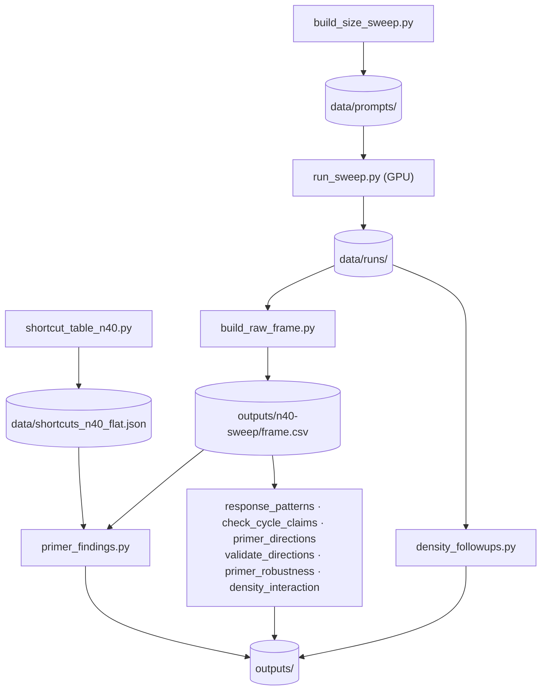

# Scripts

The pipeline, from graphs to the numbers in the docs and the paper.
[← back to the repo](../README.md)

Run everything from the repo root with `PYTHONPATH=.` and the venv active
(`source .venv/bin/activate`, or prefix each command with `uv run --no-sync`).
Only `run_sweep.py`
needs a GPU; every other stage runs on a laptop from the committed files in
`data/`.



## The pipeline

| Stage | Script | Reads | Writes |
|---|---|---|---|
| 1. Build prompts | `build_size_sweep.py` | — | `data/prompts/*.jsonl` |
| 2. Generate (GPU) | `run_sweep.py`, via [`cluster/sweep.sbatch`](../cluster/README.md) | a prompt file | `data/runs/<model>.<run>.shard<i>of<n>.jsonl` |
| Solver bars | `shortcut_table_n40.py` | — (generates its own graphs) | `data/shortcuts_n40.json`, `data/shortcuts_n40_flat.json` |
| 3. Frame | `build_raw_frame.py` | `data/runs/`, regenerated graphs | `outputs/n40-sweep/frame.csv` |
| 4. Analyses | see [Outputs](#outputs) | the frame, the runs, the prompts | `outputs/` |

The 40-node prompt files were built with:

```bash
PYTHONPATH=. python scripts/build_size_sweep.py --sizes 40 --densities 0.10 0.20 0.35 0.50 --count 100 \
    --tasks node_count node_degree connected_nodes edge_count edge_existence cycle_check \
    --conditions none components clustering rwse degree all filler --out data/prompts/prompts.densfull40.jsonl
PYTHONPATH=. python scripts/build_size_sweep.py --sizes 40 --densities 0.65 0.75 0.85 --count 100 \
    --tasks node_degree edge_existence \
    --conditions none components clustering rwse degree all filler --out data/prompts/prompts.densfull40hi.jsonl
PYTHONPATH=. python scripts/shortcut_table_n40.py --json data/shortcuts_n40.json \
    --flat-json data/shortcuts_n40_flat.json
```

`density_followups.py` rebuilds the follow-ups' prompts itself and checks each
gold answer against the runs, so only `density40`'s prompt file is committed.

## Outputs

| Script | Output (in `outputs/n40-sweep/` unless noted) | Cited by |
|---|---|---|
| `build_raw_frame.py` | `frame.csv`: one row per response, 84,000 rows | every analysis below |
| `primer_findings.py` | `primer_findings.txt`, `primer_cells.csv`, `edge_existence_collapse.csv`, `node_degree_routes.csv` | [n40-sweep.md](../docs/results/n40-sweep.md), the paper |
| `density_followups.py` | `outputs/density-followups/density_followups.txt` | [density-followups.md](../docs/results/density-followups.md), the paper |
| `check_cycle_claims.py` | `check_cycle_claims.txt`, `cycle_claims.csv`, `response_claims.csv` | [investigate_connections_and_cycles.md](../docs/investigate_connections_and_cycles.md), the paper |
| `primer_robustness.py` | `primer_robustness.txt`, `robustness_responses.csv` | [primer-robustness.md](../docs/primer-robustness.md), the paper |
| `primer_directions.py` | `primer_directions.txt` | [primer-directions.md](../docs/primer-directions.md) |
| `validate_directions.py --score` | `directions_validation.txt` | [primer-directions-validation.md](../docs/primer-directions-validation.md) |
| `response_patterns.py` | `response_patterns.txt` and four CSVs | reused by `check_cycle_claims.py`, `primer_directions.py`, `validate_directions.py` |
| `density_interaction.py` | `density_interaction.txt` | [density-interaction.md](../docs/density-interaction.md) |

Three files in `outputs/n40-sweep/` are hand-labelled *inputs*, not outputs:
`directions_validation_sheet.csv`, `directions_validation_key.csv` and
`response_pattern_validation.csv`. Never run `validate_directions.py --make` or
`response_patterns.py --sample` over them; both refuse to overwrite.

Imported by the scripts above:
- `analyze_primer_window.py`: the cell table's rule;
- `analyze_baseline_law.py`: the solver's route split;
- `score_density_sweep.py`: scoring by density level;
- `analyze_rq3_leads.py`: the `clustering` forensics.

The last two also run on their own; see their docstrings.

## Reproduce everything

About an hour on a laptop. Each command overwrites its committed output. `git
diff` should then show no change except lines that print a path.

```bash
export PYTHONPATH=. PYTHONUTF8=1
python scripts/build_raw_frame.py
python scripts/primer_findings.py --csv-dir outputs/n40-sweep > outputs/n40-sweep/primer_findings.txt
python scripts/response_patterns.py --csv-dir outputs/n40-sweep > outputs/n40-sweep/response_patterns.txt
python scripts/check_cycle_claims.py --csv-dir outputs/n40-sweep > outputs/n40-sweep/check_cycle_claims.txt
python scripts/primer_directions.py > outputs/n40-sweep/primer_directions.txt
python scripts/validate_directions.py --score > outputs/n40-sweep/directions_validation.txt
python scripts/primer_robustness.py --csv-dir outputs/n40-sweep > outputs/n40-sweep/primer_robustness.txt
python scripts/density_interaction.py > outputs/n40-sweep/density_interaction.txt
python scripts/density_followups.py > outputs/density-followups/density_followups.txt
```

Then the paper's tables and figures: see [paper/README.md](../paper/README.md).

## Utilities

| Script | What it does |
|---|---|
| `readme_figures.py` | Draws the front page's two figures into `docs/img/`: the primer effect (from `[main]`) and how a primer is used (rendered by `graphtalk/primers.py`) |
| `show_primers.py` | Prints every primer condition for a few graphs, to read by eye |
| `draw_graph.py` | Parses a graph out of a published GraphQA row and draws it |
| `primer_flips.py` | Writes every question a primer flips, with both answers side by side, for reading by hand (`outputs/n40-sweep/primer_flips.csv`, not committed) |
